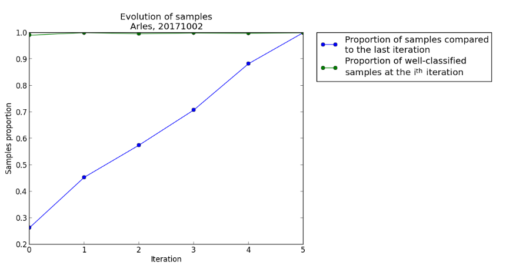
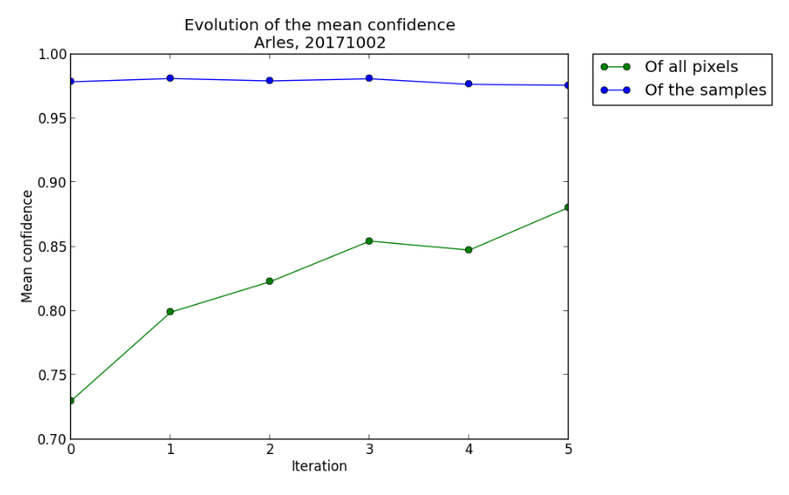
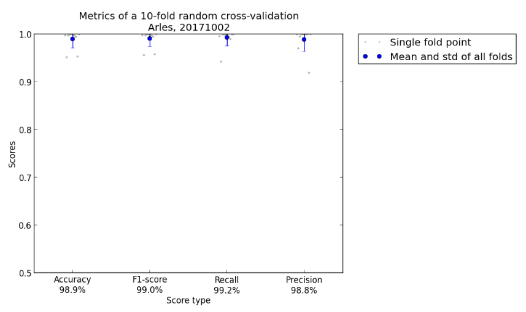

# Complementary information

Some information about the performed classification can be retrieved.

## Samples and confidence evolutions

You can run the confidence_map_exploitation.py easily with

```bash
python confidence_map_exploitation.py
```

It will generates two files in the ``Statistics`` directory.

The first one is the evolution of samples you manually placed at each iteration (example in
``Figure 1``). As you can see here, the evolution is almost linear, and it is a good practice
to follow to obtain quick results. Of course, in some difficult cases, the last iterations will
have less added points, to finely tune the classification.

The second one is the confidence evolution. The mean confidence of all the pixels should
generally increase. The confidence of the samples you placed will probably slightly de-
crease, as you will place more difficult points at each iteration.

<div style="text-align: center;">

  

  <p>Figure 1: Evolution of samples. Arles, 20171002</p>
</div>

<div style="text-align: center;">

  

  <p>Figure 2: Evolution of the mean confidence. Arles, 20171002</p>
</div>

## K-fold cross-validation

At any point, you can perform a K-fold cross-validation with the samples you placed, by
running

```bash
python all_run_alcd.py −f false −s 0 −kfold true
```

Go to the ``Statistics`` directory to see the result, notably the ``k_fold_summary.json`` file,
or the more eloquent ``kfold_metrics.png`` figure, an example of which is shown in ``Figure 3``
To have a stable classification, the four scores should be as close to 1 as possible,
for each fold.

<div style="text-align: center;">

  

  <p>Figure 3: Metrics of a 10-fold random cross-validation. Arles, 20171002</p>
</div>