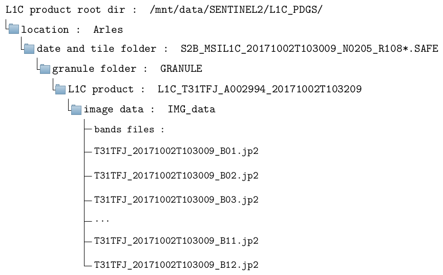
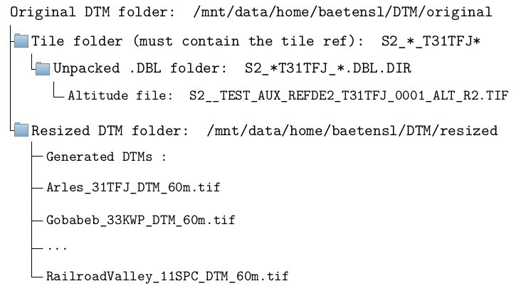

# Configure ALCD

ALCD can be configured using several configuration files

- ``global_parameters`` which contains the parameters for the various algorithms used
- ``paths_parameters`` which mainly contains paths to data
- ``model_parameters`` which contains the learning parameters

## global_parameters

A granule is defined as a set of data specified in space and time, i.e. a location and a date. For
example, a granule could be associated with Orleans, tile 31UDP, and the 13 th of April 2018. In
all the environment, a date is in format YYYYMMDD (the previous date becoming 20180413).

- ``classification``: classification parameters
  - ``method``: which method is used among : *rf_otb*, *svm_otb*, *boost_otb*,  *dt_otb*, *gbt_otb*, *knn_otb*, *rf_scikit*, *svm_scikit*, *ada_scikit*, *xtree_scikit*, *grad_scikit*, *hist_grad_scikit*. More information can be found in the [Notebook Tutorial](notebooks/montreux.ipynb#other-classification-algorithms).
- ``general``: output names for the files. Not necessary to change anything. The different files will be referred to with their default names afterwards
- ``local_paths``: specific to your environment. It is used if you run the ALCD on a distant machine, and want to modify the masks on your local machine with QGIS. 
                   Useful if the distant machine does not have a graphic card.
  - ``copy_folder``: on your local machine, where you want to edit the files
  - ``current_server``: the adress of the distant machine
- ``masks``: naming and attribution of a number to each class
- ``postprocessing``: global naming for post-processing files
- ``automatically_generated``: references to the specific case you are working on. This will be modified when running ALCD, so you do not need 
                              (and should not) change it manually
- ``training_parameters``: parameters used for the training and classification of the
algorithm. The default ones are good, but you can change them.
  - ``training_proportion``: the proportion of samples that will become training sam-
ples (between 0 and 1). The other part (1-training_proportion) will become
validating samples.
   - ``expansion_distance``: in meters, the size of the buffer zone around each sample.
This buffer zone will be used to augment the data, i.e. take the neighboring
pixels
  - ``regularization_radius``: in pixels (should be an integer), the radius for the regu-
  larization of the classification map. Typical values are between 1 and 5.
  ``dilatation_radius``: in pixels (should be an integer), the radius for the dilatation
  of the contours for the visualisation. Typical values are between 1 and 5.
  - ``Kfold``: for the K-fold cross-validation, which k to use (usually 5 or 10).
- ``features``: which features will be used for the classification.
  - ``original_bands`` : list of the bands from the cloudy date to use. It is recommended
  to use all of them.
  - ``time_difference_bands`` : list of the bands from which the difference will be made,
  between the cloudy and clear date. It is recommended to use all of them apart
  the band 10, which is noisy.
  - ``special_indices`` : list of peculiar indices. Can be composed of NDVI, NDWI, NDSI
  for the moment.
  - ``ratios`` : list of ratios. Each item should have the format "a_b", where a and b are
  bands numbers (e.g. "2_4" will produce the ratio B2/B4).
  - ``DTM`` : boolean, whether you want to use the Digital Elevation Model or not.
  - ``textures`` : boolean, whether you want to create the two texture features (coefficient
  of variation and contours density are available for the moment).
- ``user_choices``: Data location
  - ``user_module`` : path to the Python file containing the user's process, if wanted. For more information, see the [Notebook Tutorial](notebooks/montreux.ipynb#user-features).
  - ``user_function`` : name of the feature to apply, if wanted. For more information, see the [Notebook Tutorial](notebooks/montreux.ipynb#user-features).
  - ``clear_date``:  date of the non-cloudy image
  - ``current_date``: date of the cloudy image
  - ``location``: location folder
  - ``main_dir``: main directory to store the results
  - ``raw_img``: .tif image used for the training
  - ``tile``: Tile reference

## paths_parameters

- ``global_chains_paths``: contains the main paths concerning the output of the processing
chains
  - ``L1C``: the L1C products, subsequently designated as L1C product root dir
  - ``maja``: directory where the MAJA files are, subsequently designated as MAJA output
root dir
  - ``sen2cor``: directory where the Sen2cor files are, subsequently designated as Sen2cor
output root dir
  - ``fmask``: directory where the Fmask files are, subsequently designated as Fmask output
root dir
  - ``DTM_input``: directory where the Digital Terrain Model files are, subsequently desig-
nated as DTM product root dir
  - ``DTM_resized``: directory where the resized Digital Terrain Model files will be stored
- ``data_paths``: in case the Data_ALCD and Data_PCC are moved or renamed, this should
be modified
- ``tile_location``: specification of the tile code linked to a named place. You could add other
locations here.

## model_parameters

Parameters are directly referring to the OTB or Scikit-learn ones. You can therefore see the [OTB documentation](https://www.orfeo-toolbox.org/CookBook/Applications/app_TrainVectorClassifier.html) or the [Scikit-learn documentation](https://scikit-learn.org/1.5/api/sklearn.ensemble.html) for this purpose, depending on the choosen classification algorithm.

## Input data organisation

The data organisation of each of the programs outputs is defined below, with the example of
Arles on the 2 nd of October, 2017. **If your structure is different, you need to change
some variables in the code**. For each directory or file, the pattern to describe it follows the
syntax: "General name : `ExampleForArles`". The ``*`` in a path indicates that the path has been
truncated at this place.

### L1C product structure

The full path of the first band is therefore, in this example: ``/mnt/data/SENTINEL2/L1C_
PDGS/Arles/S2B_MSIL1C_20171002T103009_N0205_R108_T31TFJ_20171002T103209.SAFE/
GRANULE/L1C_T31TFJ_A002994_20171002T103209/IMG_DATA/T31TFJ_20171002T103009_
B01.jp2``

### DTM product structure

The Digital Terrain Model is specific to a tile. Therefore, there is no need to have a
copy of the DTM for each date. The original DTM should be placed in the DTM_input
directory. After the first time the ALCD is run on one location, its resized DTM will be
created in the DTM_resized directory, so as to avoid generating it each time. The format
has to be an unpacked DTM folder (.DBL).

The full path of the original DTM is therefore, in this example: ``/mnt/data/home/
baetensl/DTM/original/S2__TEST_AUX_REFDE2_Arles_T31TFJ_0002/S2__TEST_AUX_REFDE2_
T31TFJ_0001.DBL.DIR/S2__TEST_AUX_REFDE2_T31TFJ_0001_ALT_R2.TIF``. After the ALCD 
is run once on Arles, the resized DTM will be in ``/mnt/data/home/baetensl/DTM/resized/
Arles_31TFJ_DTM_60m.tif``.