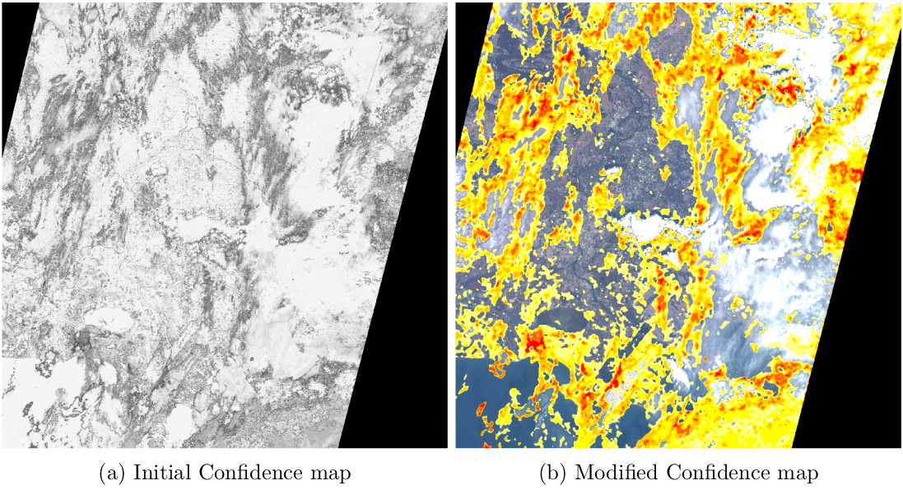

# Tips and advice

Here are some advice that you could consider to achieve a better and faster classification.

## Samples positioning

If you want to achieve a great classification, a good thing to do is to have a wide variety
of samples. This means samples that are well distributed spatially (do not take all your
samples in a radius of 1km), but also from a feature point of view, especially for the land
class. If your image contains grass, forests, sand and mountains, place samples on all these
classes, and not just on the grass one. For the ``low clouds`` and the ``high clouds`` classes, put
samples on the centre of the clouds, but also where they are thin. For the ``clouds shadows``,
select shadows over the land, over the water, and so on.

## Proportion between classes

It is a good practice to keep a balanced number of samples between classes. Therefore,
you should try not to put 10 times more land samples than ``water`` ones, or vice versa. It
is sometimes difficult to find enough samples that are well distributed spatially (see point
above), especially for ``water`` and ``snow``. In this case, you can add points not far apart, so
as to increase their number, even if it could lead to redundant information.

## Confidence map

Generally speaking, the user wants to add relevant points at each iteration. The rec-
ommendation is to check on the files ``Out/contours_labels.tif`` and ``Out/labeled_img_
regular.tif`` if the classification seems correct.
However, the confidence map is also provided. It allows to see where the classifier experi-
ences difficulties to make a clear choice between two classes. For the Random Forest (the
default classifier), the confidence of a pixel is the proportion of votes for the majority class.
For other classifiers, see the [OTB Cookbook](https://www.orfeo-toolbox.org/CookBook/Applications/app_TrainVectorClassifier.html). The confidence map has values between 0
and 1, 1 being the best confidence. The user will therefore try to add samples in the low
confidence zones. The original confidence map can be a bit difficult to read at first, mostly
due to the fact that isolated pixels of low confidence are often hard to classify even for a
human observer. Therefore, a modified confidence map is provided, consisting of zones of
low confidence, rather than pixels. To do so, a median filter is simply applied to the orig-
inal confidence map. The result are given in ``Figure 1``. To obtain the same result, apply
the style ``confidence_enhanced_style.qml`` on the ``Out/confidence_enhanced.tif`` file.

```{Warning}
Is it important to note that a high confidence does not imply a good classification.
Therefore, the classification should be checked visually first. However, a low confidence
often implies a bad classification, or at least an unstable one.
```

<div style="text-align: center;">

  

  <p>Figure 1: Enhancement of the confidence map</p>
</div>
