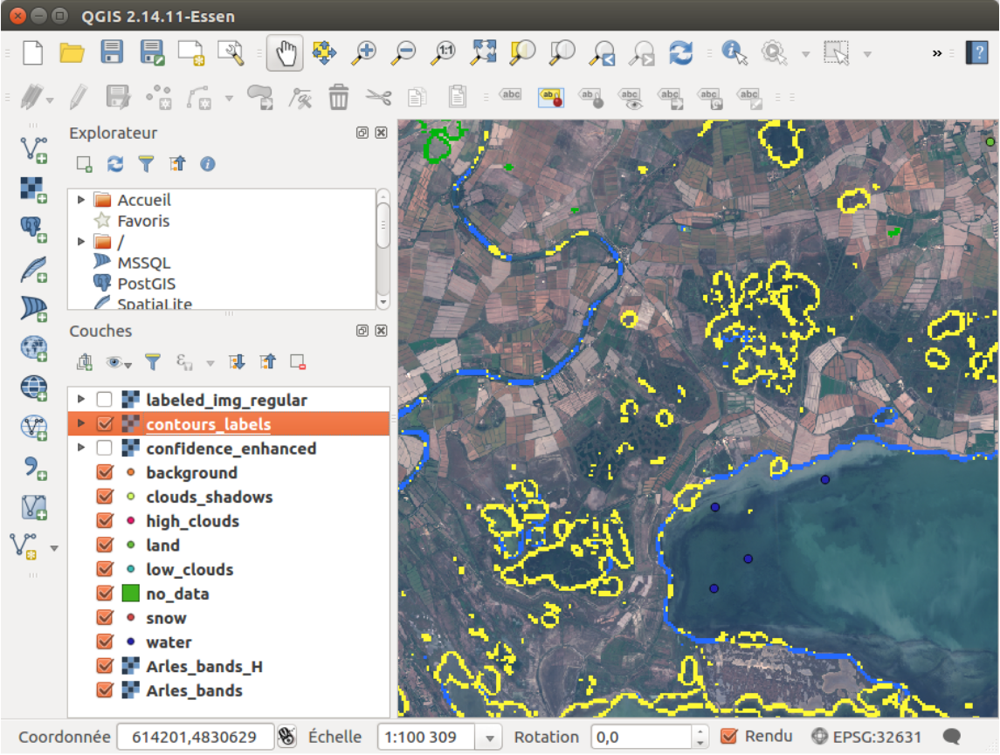
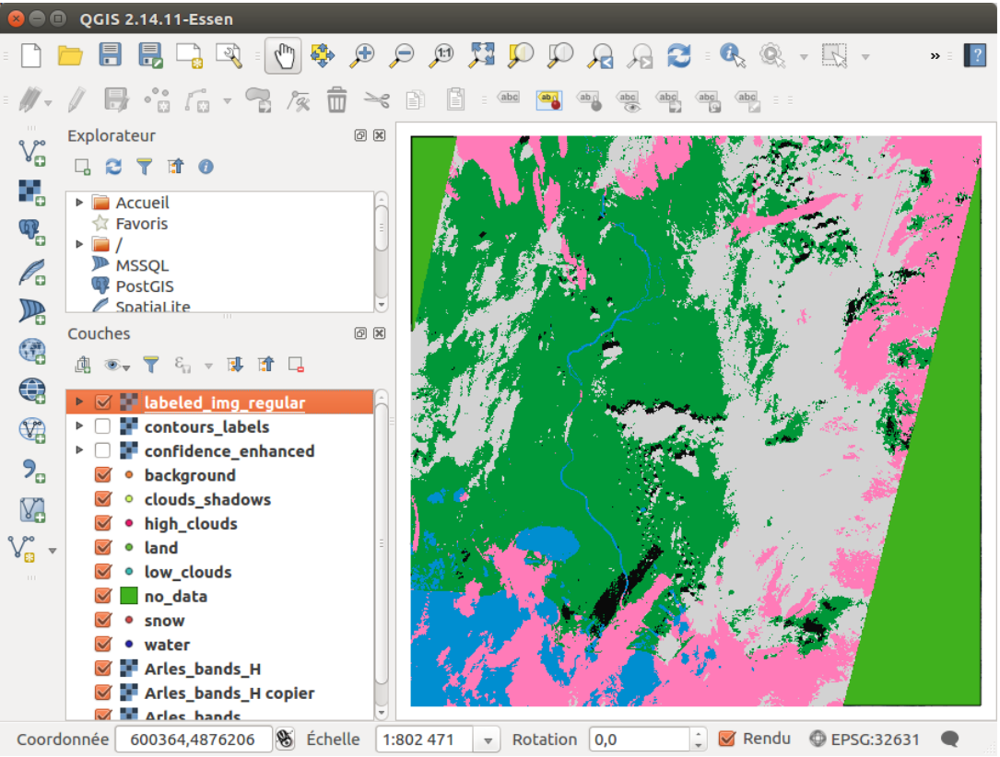

# ALCD tutorial

This is a step-by-step tutorial, to help you use the ALCD algorithm. Here, we will classify the
clouds on the image of Arles, on the 2 nd of October, 2017.
The expected result is the following:


<div style="text-align: center;">

  

  <p>Figure 1: Classification of Arles, 20171002</p>
</div>

Change to the ALCD directory. The program that you should use is all_run_alcd.py. You
can display the help with
```bash
python all_run_alcd.py −h
```

The available options are:
- ``l``: the location. The spelling should be consistent with the names in the L1C directory
(e.g. Pretoria or Orleans)
- ``d``: the (cloudy) date that you want to classify (e.g. 20180319)
- ``c``: the clear date that will help the classification (e.g. 20180321)
- ``f``: if this is the first iteration or not. If set to True, it will compute and create all
the features, and create the empty class layers. Set it to True for the first iteration, and
thereafter to False.
- ``s``: the step you want to do, the choice is between 0 and 1. 0 will create all the needed
files if this is the first iteration, otherwise it will save the previous iteration. 1 will run the
ALCD algorithm, i.e train a model and classify the image. For each iteration, you should
set it to 0, modify the masks, and then set it to 1.
- ``kfold``: boolean. If set to True, ALCD will perform a k-fold cross-validation with the
available samples.
- ``dates``: boolean. If set to True, ALCD will display the available dates for the given
location.
- ``global_parameters``: path to json file which parametrize ALCD
- ``paths_parameters``: path to json file which contain useful paths for ALCD
- ``model_parameters``: path to json file which contain classifier parameters

## Summary of the commands

The detailed steps are given after this part. We give here the summary of the commands to
use, so you can come back here if you forget how to use ALCD.

See the available dates.

```bash
python all_run_alcd.py −l Arles −dates True
```

Initialisation and creation of the features.
```bash
python all_run_alcd.py −f True −s 0 − l Arles −d 20171002 −c 20171005
```

Edit the shapefiles to populate them with manually labeled samples. Then run the algorithm.
```bash
python all_run_alcd.py −f True −s 1
```

While the results are not satisfactory:
Visualize the results. Save the current iteration.
```bash
python all_run_alcd.py −f False −s 0
```

Edit the shapefiles to your convenience. Run the algorithm again.
```bash
python all_run_alcd.py −f False −s 1
```

## Paths preparation

Before running anything, you need to set the correct paths and parameters.
In the ``paths_configuration.json``:
- Add the tile code linked to the location you want to add
- Create the output directory for ALCD, and set its path in the "data_alcd" variable
- Set the correct paths for the L1C directory and the DTM_input
In the global_parameters.json, if you use a distant and a local machine, set the ``local_paths`` variables accordingly.

## Step 1

First of all, you must pick the date you are interested in. As the code will run on the L1C
product, you can list all the available dates with the command

```bash
python all_run_alcd.py −l Arles −dates True
```

You should get a list like

```python
["20151202" , "20151230" ,... , "20180319" , "20180321"]
```

A good practice is to visualise the two dates we want to use beforehand. This can be facil-
itated by the code quicklook_generator.py, which generates quicklooks for a given location.
The user can therefore make sure that the cloud-free image is indeed cloud-free, and that the
image to be classified is interesting.
As stated above, the date we will use here is 20171002. This date was acquired just before
a cloud free date: 20171005.
Therefore, initialize the environment by running

```bash
python all_run_alcd.py −f True −s 0 − l Arles −d 20171002 −c 20171005
```

This will create the concatenated .tif with all the bands, and empty shapefiles for each class,
among other things. It invites you to copy those created files to your local machine, to accelerate the process
in QGIS (on our processing computer, visualisation is slow, so we use QGIS on a different
computer). You can also modify the files directly, in this case, you can skip the manual copy
of the files and go to Step 2. Otherwise, copy the files on your machine with QGIS, and go to
Step 2.

## Step 2

You can now open QGIS. Open the raster ``In_data/Image/Arles_bands_H.tif`` (H stands for
Heavy, as it is in full resolution of 20m per pixel), and ``In_data/Image/Arles_bands.tif``.
The ``Arles_bands_H.tif`` bands refer to the band 2 (blue), 3 (green), 4 (red), 10 (the band at
1375nm), the NDVI and the NDWI. The bands for the ``Arles_bands.tif`` are quite numerous,
but the content of each band is documented in the .txt file corresponding to each .tif.
Now, adjust the style in QGIS such that you see the image in true colors. For that, you
can load the file ``color_tables/heavy_tif_true_colors_style.qml`` on the Heavy .tif. You
should get :

<div style="text-align: center;">

  

  <p>Figure 2: QGIS window with the scene displayed in true colors</p>
</div>

Now, load all the empty shapefiles from the directory ``In_data/Masks``.
If you display a band being a time difference (for example the 20th band of ``Arles_bands.
tif``), you will observe that there was no data on the bottom-right corner for the clear date.
The same is true with the top-left corner for the cloudy date.
Thus, the no_data file already has some data (which is the case if one or both of the original
images have no_data pixels). As you can see, on ``Figure 2`` the top-left and bottom-right corners
are covered by the no-data mask. If you are not satisfied with the mask, you can edit it manually.
You should get something along the lines of the following :

<div style="text-align: center;">

  

  <p>Figure 3: No-data areas are automatically computed</p>
</div>

This no-data layer is used to discard the areas under it, be it for the classification, or if the
user add samples in these areas by mistake.

## Step 3

It is now time to edit the masks layers. For each class (land, low clouds, etc), edit the corre-
sponding layer. Add the points that you want to take as samples, by clicking on the image and
pressing Enter for each point. We have found more efficient to use points rather than polygons,
we later dilate the points by 3 pixels assuming the neighbourhood is homogeneous in terms of
class, so you should avoid to use a pixel just at the edge of a feature (cloud, land).
The high clouds can be visible with the 1375nm band (i.e. the band number 4 of the heavy
.tif). You can load the style ``heavy_tif_clouds_green_style.qml`` to see them quickly.
The ``Figure 4`` shows the image with the high clouds highlighted, and the steps to add points.

<div style="text-align: center;">

  

  <p>Figure 4: Steps to add data points with QGIS</p>
</div>

```{note}
The ``1375nm`` band is not to be trusted blindly. The principle of this band is that the
water vapour in the atmosphere usually absorbs the photons in this wavelength. However, in
dry conditions, or with high altitudes terrains (such as mountains), the photons can be reflected
back. This can be misleading, so the user should take precautions. A typical way to detect such
artefacts is to see if the potential cirrus shape is strongly correlated with that of the underlying
terrain.
```

You can now go back to true colors, and continue by editing all the wanted classes. The
background class can be used if you do not want to discriminate between land and water for
example, but its use is not recommended.
At the end, you obtain ``Figure 5``

<div style="text-align: center;">

  

  <p>Figure 5: Samples placed manually after the first iteration</p>
</div>

## Step 4

Now, copy back the edited masks to the distant machine, or skip this if you work on one machine.
It is time to train the model, and classify the image! Do it with

```bash
python all_run_alcd.py −f True −s 1
```

The results can be seen in the Out directory. The regularized classification map is labeled_
img_regular.tif. You can also see the contingency table in the Statistics directory.
As you can see on the classification map, figure 2.8, some pixels are not well classified.
Moreover, the confidence is low in numerous places, as seen on ``Figure 6``. Therefore, we will take part of the 
advantage of this program: the active learning.

<div style="text-align: center;">

  

  <p>Figure 6: Result of the first classification</p>
</div>

<div style="text-align: center;">

  

  <p>Figure 7: Confidence map of the first classification</p>
</div>

## Step 5

Do an new iteration, by running

```bash
python all_run_alcd.py −f False −s 0
```

It will save the previous iteration, and you can now edit the class layers, by adding new
points (and also remove some if you made an error previously). You can copy on your local
machine the outputs of the previous iteration (the bash command is given when you run the
command above).

We suggest to open the files ``Out/contours_labels.tif`` and ``Out/labeled_img_regular``.
tif, and to apply to them the ``contours_labeled_contrasted_style.qml`` and the ``labeled_img_regular_style.qml`` 
styles respectively. It gives each class a recognisable color, which are given in ``table 1``.

<div style="text-align: center;">

  

  <p>Table 1: Available classes and colors</p>
</div>

For example, you can display the contours of the classes to see were the classifier was wrong.
Here, we obtained a false detection of *clouds shadows* on the left of the image, which can be
seen with the yellow contours:

<div style="text-align: center;">

  

  <p>Figure 8: Contours of the shadows, in yellow</p>
</div>

Therefore, we will add some points of land class in this region to increase the accuracy of
our output, as shown in ``Figure 9``.

<div style="text-align: center;">

  

  <p>Figure 9: Some land samples are added where the wrong classification is visible</p>
</div>

Do this for the areas where a misclassification is visible.
Once the wanted points in each class have been added, you can copy back the layers to the
distant machine with the appropriate command.
Finally, you run once again the training and the classification with

```bash
python all_run_alcd.py −f False −s 1
```

## Step 6

Repeat the Step 5 until you are satisfied with the classification the ALCD algorithm returns.

Quick tip: some data (30% by default) are used for the validation of the model, i.e. just
to compute statistics. If you want to have more samples that you add manually to be taken
into account for the training part, you can increase the training_proportion in the ``global_
parameters.json``.

Here is an example of the classification that you could obtain after each iteration. The 6 th
one is considered to be good (by myself), so you can stop there.

<div style="text-align: center;">

  

  <p>Figure 10: Evolution of the classification</p>
</div>

As a reference, the QGIS windows at the last iteration with all the samples, with the labeled
classification, and with the confidence map, are given in ``Figures 11, 12 and 13``.

<div style="text-align: center;">

  

  <p>Figure 11: All samples present for the last iteration</p>
</div>

<div style="text-align: center;">

  

  <p>Figure 12: Labeled classification as seen in QGIS window for the last iteration</p>
</div>

<div style="text-align: center;">

  

  <p>Figure 13: Confidence map as seen in QGIS for the last iteration</p>
</div>


{doc}`water_mask <configure_alcd>`.
