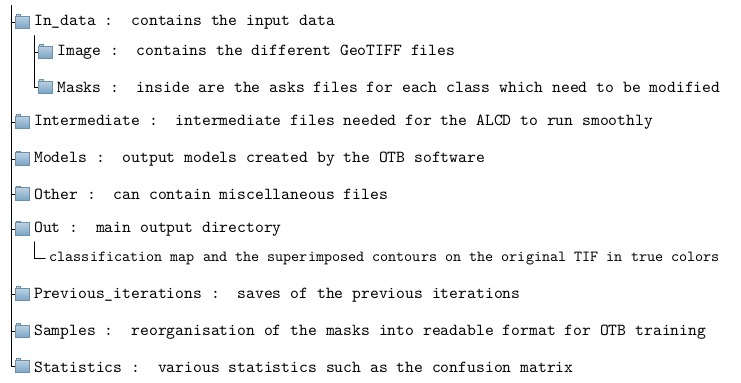
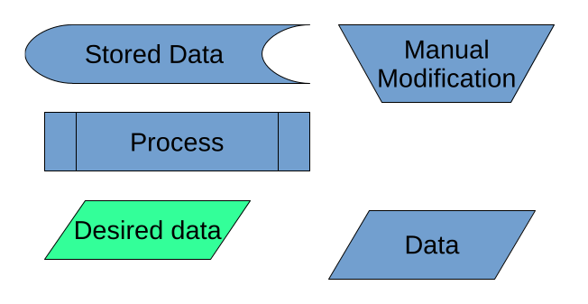
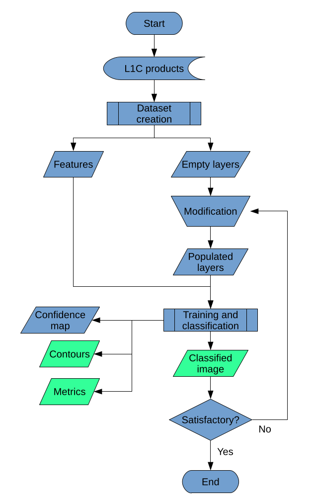

# ALCD workflow

## data organisation

The output structure of the code is the following, for a given location and date:
location and date dir : ``main directory``; e.g. ``Arles_31TFJ_20171002``

## Code workflow and overview

The ALCD framework is based on multi-spectral and multi-temporal features. The user will
have to choose two images separated by a few days: a reference cloud free image, it usually
happens from time to time in a time series, and an image to classify. The latter should have
been acquired before the reference image, otherwise MAJA, which is also multi-temporal will
be favoured as it uses cloud free pixels in the past to classify the pixels. The user should select
an image which is as cloud-free as possible, along the cloudy image which he wishes to classify.
The closer the two dates, the better.

Firstly, the different features are compiled into two GeoTIFF. The features described below
8are the one created if you use the recommended parameters.

- The main TIF contains all the 12 bands of the cloudy date, the NDVI and NDWI computed
from them, the difference between the bands of the cloudy date and the cloud-free date,
and the Digital Terrain Model (DTM) of the area, with a coarse resolution (60 meters).

- The second TIF, so-called ’heavy’, contains the bands 2, 3, 4, 10, the NDVI and the
NDWI of the cloudy image, with a full resolution (10 or 20 meters). This allows the user
to conveniently select the samples.

Then, the user is asked to put some points in a vector format, such that it labels the image.
Then, the user is asked to manually add reference points with QGIS. Each wanted class
should have at least 3 references points. One empty layer per class is created in the previous
step, such that the user needs to populate them, or leave some of them empty if the class is not
present in the image (e.g. with snow).
The OTB workflow is then put into motion, training a model and classifying the image. The
classification is the output of the ALCD algorithm.
The user can afterwards add new vector points to refined the model, in an iterative way.

  

  
Flowcharts nomenclature

  

  
Flowcharts nomenclature

